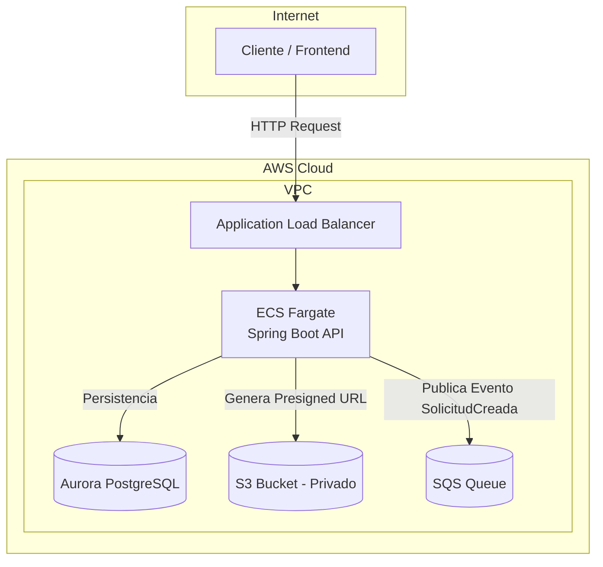

# Fleet Registration Service

Microservicio desarrollado en Java 21 + Spring Boot 3.5.10 para la gestión de solicitudes de inscripción de vehículos.

El proyecto incluye:

- Backend REST API (/backend)
- Infraestructura como Código con AWS CDK (/infra)
- Arquitectura desacoplada con eventos
- Persistencia en PostgreSQL (Aurora en AWS)
- Almacenamiento de documentos en S3 mediante Presigned URLs
- Publicación de eventos en SQS
- Tests unitarios para lógica de negocio
---

# 📦 Estructura del Proyecto
```text
fleet/
├── backend/
│   ├── src/main/java/com/arkho/fleet
│   │   ├── controller/         → Exposición de endpoints REST
│   │   ├── service/            → Lógica de negocio
│   │   ├── domain/             → Entidades JPA y reglas de dominio
│   │   ├── repository/         → Interfaces Spring Data JPA
│   │   ├── dto/                → Objetos de transferencia
│   │   ├── event/              → Eventos de dominio y publisher
│   │   ├── exception/          → Manejo global de errores
│   │   └── config/             → Configuraciones
│   │
│   ├── src/main/resources/
│   │   └── application.yml
│   │
│   ├── Dockerfile
│   ├── docker-compose.yml
│   └── pom.xml
│
├── infra/
│   ├── bin/
│   ├── lib/
│   │   └── fleet-stack.ts      → Definición del Stack AWS
│   ├── package.json
│   └── cdk.json
│
└── README.md
```

---

# 🚀 Ejecutar el backend localmente

## Requisitos

- Docker
- Docker Compose

## Levantar el entorno

```bash
cd backend
docker compose up --build
```
Esto levantará:

- PostgreSQL 15
- Backend Spring Boot en http://localhost:8080

## Endpoints Disponibles
### Crear Solicitud: POST /api/v1/solicitud

Ejemplo:
```bash
curl -X POST http://localhost:8080/api/v1/solicitud \
-H "Content-Type: application/json" \
-d '{
"plate": "ABC123",
"brand": "Toyota",
"model": "Corolla",
"year": 2020,
"ownerName": "John Doe",
"ownerEmail": "john@mail.com"
}'
```
Respuesta:
```bash
201 Created 
{
    "id": "5e04f8f9-14aa-4f70-b4f0-28a1f7a05e01"
}
```
### Listar Solicitudes (con paginación): 
GET /api/v1/solicitud?page=0&size=10
### Obtener por ID: 
GET /api/v1/registrations/{id}
### Generar URL Prefirmada para documento
POST /api/v1/solicitud/{id}/documentos/upload-url
Retorna una URL firmada de S3 para subir directamente el archivo desde el frontend.

## Validaciones Implementadas

- Formato correcto de patente
- Año no puede ser futuro
- No se permiten patentes duplicadas (constraint + verificación previa)
- Sanitización de inputs (trim + normalización)
- Manejo global de excepciones
- No exposición de stack traces

# 🧪 Tests

Se implementaron tests unitarios (JUnit 5 + Mockito) sobre la lógica de negocio principal en:
RegistrationServiceTest.
Para ejecutar los tests:
```bash
cd backend
mvn clean test
```

Se cubren:

- Caso exitoso
- Año futuro
- Patente duplicada
- Formato inválido

# ☁ Infraestructura (AWS CDK)

La infraestructura fue definida utilizando AWS CDK v2 en TypeScript.

Para validar que el stack es sintetizable:
```bash
cd infra
npm install
cdk synth
```
## Arquitectura Propuesta



## Flujo de Datos

1. El cliente envía una solicitud HTTP al Application Load Balancer.
2. El ALB enruta la petición al servicio desplegado en ECS Fargate.
3. La aplicación persiste la información en Aurora PostgreSQL.
4. Se genera una URL prefirmada para carga de documentos en S3.
5. Se publica un evento de dominio en SQS para procesamiento asíncrono.

# 📌 Decisiones de Arquitectura
## Persistencia

Se eligió PostgreSQL (Aurora PostgreSQL) como motor de base de datos
utilizando JPA/Hibernate.

El dominio requiere:

- Integridad fuerte (patente única).
- Transacciones ACID.
- Validaciones consistentes.
- Paginación sencilla.
- Posible evolución a consultas más complejas.

PostgreSQL permite definir restricciones UNIQUE de forma nativa y
garantiza consistencia fuerte en escritura, lo cual simplifica la
implementación de reglas de negocio.

DynamoDB es una excelente opción para sistemas altamente escalables
basados en patrones de acceso definidos, pero para este caso relacional
con validaciones transaccionales estrictas, una base de datos relacional
es una mejor elección.


## Asincronía

Una vez persistida la solicitud exitosamente, se publica un evento
de dominio `RegistrationCreatedEvent`.

La publicación ocurre AFTER_COMMIT para garantizar consistencia.

El envío a SQS se simula mediante un log estructurado en formato JSON.
La arquitectura permite reemplazar fácilmente esta implementación por
una integración real con AWS SQS.

## Computación

Se eligió ECS Fargate porque:

- Permite desplegar el microservicio Spring Boot sin refactorización
- Arquitectura basada en contenedores
- Separación clara entre aplicación e infraestructura

## Almacenamiento

Se utiliza S3 privado con Presigned URLs para:

- Evitar que el backend procese binarios
- Reducir carga y latencia
- Mejorar escalabilidad

## Mensajería

Se utiliza SQS para publicar el evento SolicitudCreada de manera desacoplada.

## Robustez y Seguridad

- Idempotencia mediante verificación y constraint único
- Validaciones de negocio en capa Service
- Principio de mínimo privilegio en IAM (CDK)
- Manejo centralizado de excepciones
- No exposición de información sensible

# 📌 Tecnologías

- Java 21
- Spring Boot 3.5.10
- PostgreSQL 15 (Aurora en AWS)
- JPA / Hibernate
- JUnit 5 / Mockito
- AWS CDK v2 (TypeScript)
- ECS Fargate
- S3
- SQS

# 📎 Autor

Rommel Chocho
